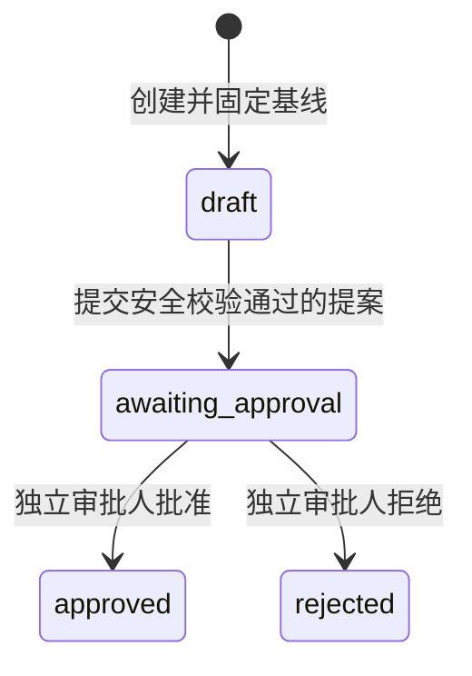

# 受控开发变更标准（阶段 8A）

## 1. 目标与权限边界

阶段 8A 建立从已批准立项包到代码变更提案的可信交接。系统只接收、校验、保存和展示统一 Diff，并记录人工审批结论；不会应用补丁、创建或切换分支、执行命令、提交、推送、合并或部署。

阶段 8A 交付时 `execution_enabled=false`；接入阶段 8B 后该字段反映服务端真实配置。无论取值为何，任何调用方都不得把 `approved` 解释为代码已经落盘或测试已经执行，只有 `verified` 才表示隔离验证通过。

## 2. 前置门禁

创建变更会话必须同时满足：

- 立项包来自已批准规划会话，且七类工件的最新评审均为 `approve`；评审哈希必须等于当前 `definition_hash`。
- 追踪矩阵所有记录均为 `covered`。
- 调用者具有 `developer` 或 `knowledge_admin` 角色，并通过项目/仓库 ACL。
- Git 仓库存在已提交 `HEAD` 且工作区完全干净；仓库仍受 `EKBDA_WORKSPACE_ROOT` 边界保护。
- 请求显式声明允许修改的相对路径前缀和允许请求的命令 ID。

创建成功后固定保存立项包 ID、名称、版本、定义哈希、规划会话 ID、仓库、基线提交、原分支和计划分支名。计划分支统一使用 `codex/<project>/<session-prefix>`，但本阶段不真实创建。

## 3. 状态机

- 所有写操作必须携带当前 `revision`，不匹配返回冲突。
- 只有会话创建者可以从 `draft` 提交提案。
- 决策要求 `project_approver` 或 `knowledge_admin`；创建者不得审批自己的提案。
- `approved` 和 `rejected` 均为不可变终态；重新修改必须创建新会话，以重新固定基线和范围。
- 创建、提交和决策均写入单调递增事件流。

## 4. 补丁安全规则

只接受 UTF-8、LF/CRLF 可规范化且以换行结束的 Git unified diff。限制为 512 KiB、50 个文件和 10000 行增删。

允许：

- 同一路径的普通文件新增、修改和删除。
- `new file mode 100644`、`deleted file mode 100644` 和普通 `index` 元数据。
- 可验证原/新行数的标准 `@@` hunk。

拒绝：

- 绝对路径、`..`、重复路径、不安全字符、超长路径和批准范围外路径。
- rename、copy、mode change、symlink、submodule、二进制 Patch 或非标准元数据。
- `.git`、`.env*`、凭据文件、私钥、证书密钥库等敏感路径。
- 新增行中命中私钥、AWS Key、GitHub Token、JWT 或常见密码/令牌赋值的高置信秘密。
- hunk 行数不一致、缺少头部、无实际增删或格式不完整的补丁。

内置秘密规则是纵深防御，不替代企业 Secret Scanner。后续真正落盘前必须再次运行企业批准的扫描器。

## 5. 命令计划

提案只引用服务端命令目录中的稳定 ID，不接受任意 Shell 文本、可执行路径或调用方参数。阶段 8A 目录包括：

| ID | 固定参数数组 | 用途 |
|---|---|---|
| `git-diff-check` | `git diff --check` | 空白与冲突标记检查 |
| `go-test-all` | `go test ./...` | Go 测试 |
| `go-vet-all` | `go vet ./...` | Go 静态检查 |
| `go-build-all` | `go build ./...` | Go 构建 |

这些命令仅作为后续执行计划持久化，不在本阶段运行。未来扩大目录必须逐条进行参数注入、仓库脚本、副作用和资源上限审查。

## 6. API 与数据保护

| 方法 | 路径 | 说明 |
|---|---|---|
| `GET` | `/api/v1/development/commands` | 查询固定命令目录和执行能力标志 |
| `POST` | `/api/v1/development/sessions` | 创建变更会话 |
| `GET` | `/api/v1/development/sessions?project=...` | 查询项目会话 |
| `GET` | `/api/v1/development/sessions/{id}` | 查询会话元数据 |
| `POST` | `/api/v1/development/sessions/{id}/proposals` | 提交只读变更提案 |
| `GET` | `/api/v1/development/sessions/{id}/preview` | 在项目 ACL 下读取完整 Diff |
| `POST` | `/api/v1/development/sessions/{id}/decision` | 独立人工决策 |
| `GET` | `/api/v1/development/sessions/{id}/events` | 查询不可变审计事件 |

普通会话和列表响应不包含 Patch 正文，只返回哈希、字节数、文件统计和固定命令计划。完整正文只能通过单独 preview 接口在项目 ACL 校验后读取。Memory 与 PostgreSQL 必须保持相同状态、乐观锁和事件语义。

## 7. 验收标准

- 未完成七工件最新审批、追踪覆盖不完整、无 HEAD 或工作区脏时不能创建。
- 创建后立项包哈希、基线提交、允许路径和命令目录不可更改。
- 提交和审批前都重新检查干净状态与相同 `HEAD`；漂移时失败关闭。
- 路径逃逸、范围越界、敏感路径、疑似秘密、非法命令和畸形 hunk 均被自动化测试拒绝。
- 创建者自审批被拒绝，错误修订号不能覆盖并发更新。
- 普通 JSON 响应不泄露 Patch；preview 受项目/仓库 ACL 保护。
- `go test ./...`、`go vet ./...` 和 `go build ./cmd/server` 通过；PostgreSQL 往返在提供测试 DSN 时通过。

## 8. 阶段 8B 交接

阶段 8B 已增加默认关闭的本地隔离执行器，详见 [`CONTROLLED_EXECUTION_STANDARD.md`](./CONTROLLED_EXECUTION_STANDARD.md)。它提供隔离克隆、Patch 应用、纵深秘密扫描、规范门禁、固定命令和证据留存，但不是容器级强安全沙箱；生产分支合并和部署仍属于更高权限阶段。

阶段 8C 已在 8B 验证语义之上增加非特权容器、企业 Secret Scanner，以及受控 Branch、Commit、Push 和 PR，详见 [`CONTROLLED_DELIVERY_STANDARD.md`](./CONTROLLED_DELIVERY_STANDARD.md)。保护分支合并、发布和部署仍不属于开发变更会话权限。
