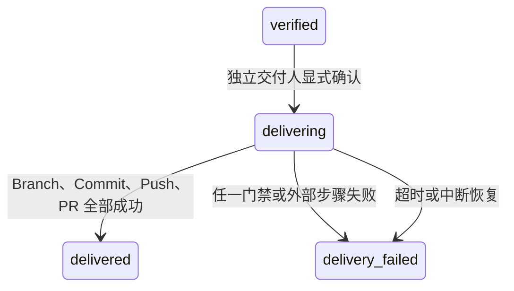

# 强隔离与受控代码交付标准（阶段 8C）

## 1. 目标与边界

阶段 8C 将已审批 Patch 的验证命令迁移到非特权容器，并把企业 Secret Scanner 设为执行和交付的强制门禁。只有状态为 `verified` 的会话才能进入受控分支、Commit、Push 和 PR 流程。

本阶段不会合并 PR、修改保护分支、触发生产部署或绕过代码托管平台审批。容器运行时、扫描器、Git 身份和 PR 提供器均由平台管理员在服务启动时固定，API 调用方不能传入镜像、命令、参数、远端或凭据。

## 2. 生产启用条件

强隔离执行默认关闭。生产启用至少需要：

```text
EKBDA_DEVELOPMENT_EXECUTION_ENABLED=true
EKBDA_DEVELOPMENT_EXECUTION_DRIVER=container
EKBDA_DEVELOPMENT_EXECUTION_ROOT=<独立执行目录>
EKBDA_DEVELOPMENT_CONTAINER_IMAGE=<带 sha256 摘要的已批准镜像>
EKBDA_DEVELOPMENT_SECRET_SCANNER_BINARY=<企业扫描器可执行文件>
EKBDA_DEVELOPMENT_SECRET_SCANNER_ARGS_JSON=<包含一次 {repository} 的 JSON 参数数组>
```

容器镜像必须使用 `@sha256:<64 位摘要>`，运行时禁止自动拉取。执行根目录必须已存在，且不能与源码工作区重叠。扫描器缺失、参数非法或不可执行时，服务启动失败。

阶段 8B 的本地执行器仅保留为显式 `local` 开发模式；它不具备 8C 强隔离保证。

## 3. 容器安全基线

每条批准命令都启动一个全新容器，固定应用以下策略：

- `--pull=never`，只允许使用节点上预置并经摘要固定的镜像；
- `--network=none` 和 `--ipc=none`，不共享宿主网络或 IPC；
- 根文件系统只读，源码隔离副本以只读 Bind Mount 挂载；
- `--cap-drop=ALL`、`no-new-privileges` 和固定非 root UID/GID；
- 固定 CPU、内存、PID 数量和带容量上限的 `/tmp`；
- 不挂载 Docker Socket、宿主 Home、源码工作区、服务配置或服务密钥；
- Go 工具链保持 `GOPROXY=off`、`GOSUMDB=off`、`GOTOOLCHAIN=local`、`CGO_ENABLED=0`；
- 可选 Go Module 缓存只能以只读方式挂载。

平台部署还必须使用 rootless 容器运行时或等价企业沙箱、默认 Seccomp/AppArmor/SELinux 策略以及节点级出站拒绝。应用参数不能替代运行时和基础设施策略审计。

## 4. 企业 Secret Scanner

内置高置信规则继续作为第一层纵深防御；外部企业扫描器是 8C 的强制门禁：

- 在容器命令执行前扫描应用 Patch 后的完整隔离仓库；
- 在创建 Commit 和 Push 前再次扫描独立交付克隆；
- 只向扫描器传递最小系统环境和显式环境变量白名单；
- 不保存扫描器原始输出，只保存名称、通过状态、耗时、输出字节数和 SHA-256；
- 非零退出、超时、输出超限或进程异常全部按失败处理；
- 扫描失败不能由 API 调用方覆盖或降级。

扫描器规则、版本、许可证、例外审批和结果归档由企业安全平台治理；EKBDA 不提供忽略规则参数。

## 5. 受控交付状态机



- 交付人必须具备 `project_approver` 或 `knowledge_admin`，且不能是会话创建者；
- 请求必须携带当前 `revision`、准确 `patch_hash` 和确认词 `deliver_verified_change`；
- 交付前重新校验源仓库干净、`HEAD` 等于固定基线、立项包哈希未变、七工件最新审批和追踪覆盖仍有效；
- 计划分支名沿用创建会话时固定的 `codex/<project>/<session-prefix>`，API 不能覆盖；
- `delivery_failed` 不自动重试。Push 成功而 PR 创建失败时会保留 `branch_pushed=true`，要求人工对账，禁止盲目重推。

## 6. Git 与 PR 控制

交付器在独立目录中从只读源码仓库创建无硬链接克隆，不修改源工作树：

1. 校验固定基线、基线分支、计划分支和批准远端；
2. 从固定基线创建计划分支；
3. 对 Patch 执行 `git apply --check` 后应用；
4. 运行内置与企业 Secret Scanner；
5. 只暂存提案记录的文件路径；
6. 使用服务端固定作者创建非签名、无 Hook 的 Commit；
7. 使用不带 `--force` 的 Push 创建远端分支；
8. 通过固定 GitHub/GitHub Enterprise CLI 创建 PR；
9. 再次确认源仓库未变化，并清理交付克隆。

HTTPS Git 凭据只通过临时 AskPass 环境提供，不写入命令参数、仓库配置、事件或响应。PR 提供器只接收 `GH_TOKEN`、`GH_ENTERPRISE_TOKEN`、`GH_HOST` 等明确白名单变量，PR URL 必须是无用户信息的 HTTPS URL。

## 7. API 与证据

| 方法 | 路径 | 说明 |
|---|---|---|
| `GET` | `/api/v1/development/commands` | 返回固定命令及 `execution_enabled`、`delivery_enabled` |
| `POST` | `/api/v1/development/sessions/{id}/execute` | 在强隔离环境验证已审批 Patch |
| `POST` | `/api/v1/development/sessions/{id}/deliver` | 对已验证会话创建 Branch、Commit、Push 和 PR |
| `GET` | `/api/v1/development/sessions/{id}` | 查询执行与交付证据 |
| `GET` | `/api/v1/development/sessions/{id}/events` | 查询完整状态审计事件 |

交付证据包含交付 ID、分支、Commit SHA、远端别名、Push 状态、PR URL、扫描证据、稳定错误码、交付人、起止时间、耗时和临时副本清理结果。Memory 与 PostgreSQL 使用同一 JSON 语义和乐观锁。

## 8. 中断恢复与人工对账

服务定期扫描超过“交付超时 + 30 秒宽限”的 `delivering` 会话，以乐观锁标记 `delivery_interrupted`，并只清理匹配交付 ID 的本地目录。因为中断前可能已经发生远端 Push 或 PR 创建，恢复流程不会自动删除远端分支、关闭 PR 或重试外部副作用；运维人员必须根据事件、远端分支和平台审计日志完成对账。

## 9. 验收标准

- 未固定摘要的镜像、缺失容器运行时或缺失企业扫描器时启动失败；
- 容器参数自动化测试覆盖禁网、只读、去能力、非 root、CPU/内存/PID/临时磁盘限制和禁止拉取；
- 扫描器通过、拒绝、超时和异常均产生无原文的确定性证据；
- 真实 Git 测试证明源仓库不变，并在测试远端产生唯一受控分支和 Commit；
- 自交付、错误修订、错误 Patch 哈希、未验证状态和禁用交付均被拒绝；
- HTTP 测试覆盖独立交付角色和 `delivered` 响应；
- 执行和交付中断均可恢复，且只清理对应本地目录；
- `go test ./...`、`go vet ./...`、服务构建和 Compose 配置检查通过。
