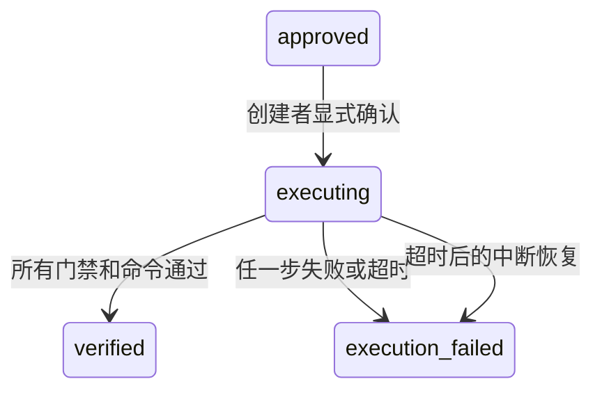

# 受控隔离执行标准（阶段 8B）

## 1. 目标与默认策略

阶段 8B 对阶段 8A 已审批的 Patch 执行一次可审计验证。执行只发生在临时本地隔离克隆中，不修改源工作树内容，不创建业务分支，不提交、不推送、不合并、不部署。

执行能力默认关闭。只有显式设置以下配置后服务才会初始化执行器：

```text
EKBDA_DEVELOPMENT_EXECUTION_ENABLED=true
EKBDA_DEVELOPMENT_EXECUTION_ROOT=<独立的专用空目录>
EKBDA_DEVELOPMENT_EXECUTION_TIMEOUT_SECONDS=120
```

执行根目录和 `EKBDA_WORKSPACE_ROOT` 不得相同、互相包含或通过符号链接重叠。配置无效时服务启动失败；关闭状态调用执行接口返回 `503`。

## 2. 执行前置条件

- 会话必须处于 `approved`，且存在固定 Patch 与命令计划。
- 只有会话创建者可以触发执行，并仍需 `developer` 或 `knowledge_admin` 角色及项目/仓库 ACL。
- 请求必须携带当前 `revision`、准确的 `patch_hash` 和固定确认词 `execute_approved_patch`。
- 服务重新计算“基线 + Patch + 命令 ID”哈希，拒绝持久化内容被篡改的会话。
- 源仓库必须仍然干净，`HEAD` 必须等于会话基线。
- 固定立项包哈希必须未变，七类工件的最新评审仍须全部批准，追踪覆盖仍须完整。

## 3. 隔离与原子清理

执行器使用源仓库本地路径创建 `--no-hardlinks --no-tags --no-checkout --local` 隔离克隆，再以 detached HEAD 检出批准基线。这样不会写源仓库 `.git/worktrees` 元数据，也不会共享可写对象硬链接。

- Git 全局/系统配置、终端凭据提示、可选锁、fsmonitor、maintenance 和 Hooks 均关闭。
- Patch 先执行 `git apply --check --whitespace=error-all`，通过后才在隔离副本应用。
- 每次执行拥有唯一目录 `ekbda-execution-<execution-id>-*`，正常结束无论成功失败都递归清理。
- 服务每 30 秒扫描超出“整体超时 + 30 秒宽限”的 `executing` 会话；使用乐观锁标记 `execution_interrupted` 后，只清理该执行 ID 对应的目录，不能清理其他实例的活动目录。
- 原源码在命令结束后再次校验；期间发生 HEAD 或脏状态变化时，本次证据判为失败。

## 4. 门禁顺序

固定执行顺序如下，任一步失败后不执行后续步骤：

1. 重新验证源仓库基线与干净状态。
2. 创建隔离克隆并 detached checkout。
3. Patch `--check` 与应用。
4. 对所有变更后文件执行高置信秘密与敏感文件扫描。
5. 对隔离副本全文件清单执行当前 common、technology、project 三层企业规范门禁。
6. 按提案顺序运行服务端固定命令。
7. 再次验证源仓库未变化并清理隔离目录。

秘密扫描是应用前 Patch 扫描之外的纵深检查：修改已有文件的一行时，整个变更后文件都要重新扫描。该检查不能替代企业专用 Secret Scanner；生产强执行器仍应接入经过批准的扫描产品。

## 5. 固定命令执行策略

执行器忽略持久化命令中的可执行文件和参数，只根据服务端命令 ID 重新解析当前固定目录，防止数据库内容篡改形成任意命令执行。

- 每条命令和整个执行均受 `EKBDA_DEVELOPMENT_EXECUTION_TIMEOUT_SECONDS` 限制。
- stdout、stderr 分别限制为 1 MiB；超限立即取消命令。
- 不保存输出正文，只保存字节数和截断边界内的 SHA-256，减少日志和密钥泄漏。
- 只传递 PATH、系统运行必需项等最小环境变量，不把 EKBDA 密钥或调用进程业务变量传给被测代码。
- Go 使用隔离 `GOCACHE/GOMODCACHE/GOTMPDIR`、`GOPROXY=off`、`GOSUMDB=off`、`GOTOOLCHAIN=local`、`GOWORK=off`、`CGO_ENABLED=0`。
- HTTP/HTTPS/ALL proxy 指向拒绝端口，Git 禁止凭据提示。

上述网络策略是进程环境层的默认拒绝，不能阻止测试代码直接创建 Socket，也不提供内存、CPU、系统调用或主机文件系统的强隔离。因此该本地执行器默认关闭，只适合受信任代码的开发/CI 验证；在容器、虚拟机或企业沙箱运行器完成前不得对不可信代码开放。

## 6. 状态与证据



`verified` 和 `execution_failed` 均为终态。失败后修改 Patch、范围或命令必须新建会话并重新审批，不能在原会话静默重试。

执行证据包含：执行 ID、基线、Patch 哈希、隔离模式、网络策略、秘密扫描结果、规范报告 ID、逐命令退出码/超时/耗时/输出字节数/输出哈希、稳定错误码、执行人、起止时间、总耗时和隔离副本清理结果。创建、执行开始、通过、失败和中断恢复继续进入不可变事件流。

## 7. API

| 方法 | 路径 | 说明 |
|---|---|---|
| `GET` | `/api/v1/development/commands` | 返回固定命令目录与实际 `execution_enabled` |
| `POST` | `/api/v1/development/sessions/{id}/execute` | 对已审批会话执行一次隔离验证 |
| `GET` | `/api/v1/development/sessions/{id}` | 查询状态与执行证据 |
| `GET` | `/api/v1/development/sessions/{id}/events` | 查询完整状态审计事件 |

## 8. 验收标准

- 默认关闭和配置失败关闭经过自动化测试。
- 源码根目录与执行根目录重叠、越界仓库和基线漂移被拒绝。
- 真实 Git 测试验证隔离克隆应用 Patch 后源文件和源仓库状态不变。
- 变更后全文件秘密扫描、规范阻断门禁和命令失败能停止后续步骤。
- 固定 Go 命令可在无外部依赖示例仓库中离线运行并产生证据。
- 普通输出正文不进入会话或事件存储。
- 正常执行清理副本；中断恢复只清理超过宽限期且与执行 ID 匹配的目录。
- Memory/PostgreSQL 保存相同状态、证据和恢复查询语义。
- `go test ./...`、`go vet ./...`、服务构建和 Compose 配置检查通过。

## 9. 阶段 8C 交接

阶段 8C 已增加摘要固定的非特权容器驱动、禁网和资源限制、企业 Secret Scanner，以及独立克隆中的受控 Branch、Commit、Push 和 PR，详见 [`CONTROLLED_DELIVERY_STANDARD.md`](./CONTROLLED_DELIVERY_STANDARD.md)。阶段 8B 的本地执行器继续只用于受信任开发环境；生产必须使用 8C 容器驱动并由平台落实 rootless 运行时、系统调用策略、签名镜像准入和节点级网络策略。保护分支合并、发布与部署仍保持关闭。
