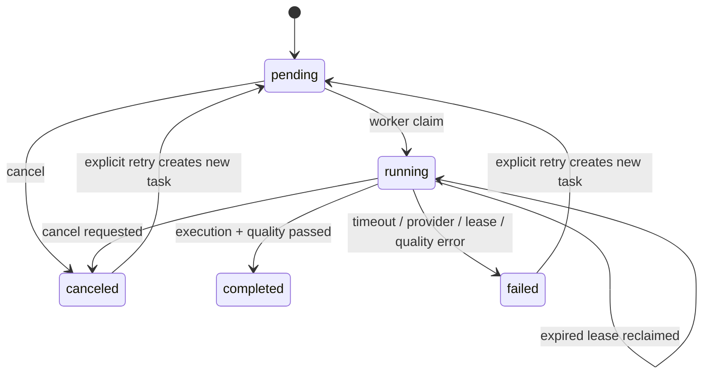

# Agent 异步任务运行标准

## 1. 目标与边界

本标准约束 EKBDA 中耗时 Agent 步骤的异步执行、恢复、取消、重试、成本记录和质量门禁。当前纳入：

- `role_review`：对一个处于 `awaiting_role_review` 的规划会话执行五角色评审与协调。
- `project_package`：从一个已批准规划会话发布新的项目立项包版本。

一个任务只执行一个业务步骤。任务运行时不扩大原业务权限，不授予代码修改、合并、外部网络访问、基础设施变更或部署权限。原同步 API 暂时保留用于兼容，生产调用应逐步迁移到异步任务 API。

## 2. 状态机

`completed`、`failed`、`canceled` 为当前任务的终态。重试不修改原任务，而是创建带 `retry_of_task_id` 的新任务。

## 3. 创建与授权

### 3.1 角色评审任务

- 请求包含规划会话 ID 和当前修订号。
- 会话必须处于 `awaiting_role_review`。
- 默认仅会话创建者可创建；`project_approver` 或 `knowledge_admin` 可按治理职责代办。
- 创建和执行均复用项目/仓库 ACL、角色列表和治理覆盖标志。

### 3.2 立项包任务

- 请求包含已批准规划会话 ID、包名和非空变更说明。
- 调用者必须具有 `project_approver` 或 `knowledge_admin`。
- 任务执行仍由立项包服务验证规划批准、五角色完整性、冲突决议、引用白名单和追踪矩阵。

### 3.3 查询与管理

- 项目授权成员可查询单任务及项目任务历史。
- 只有任务创建者或 `knowledge_admin` 可取消、重试任务。
- 立项包任务重试仍要求 `project_approver` 或 `knowledge_admin`。

## 4. 租约与恢复

- Worker 领取任务时写入唯一 `worker_id` 和租约截止时间。
- 运行中每 10 秒续租，默认租约为 30 秒。
- 服务启动时立即扫描 `pending` 和租约过期的 `running` 任务，之后每 5 秒继续扫描。
- PostgreSQL 通过条件更新原子领取；多个实例可同时扫描，但只有一个实例能够取得同一任务。
- Worker 异常退出后不直接判定失败；租约过期后由存活实例重新执行该步骤。
- 业务输出自身必须具备幂等或乐观锁保护。角色评审使用会话修订号，立项包使用不可变自动版本，避免静默覆盖。

## 5. 超时与取消

- 每个任务拥有独立 `context`，默认最长运行 600 秒，可通过 `EKBDA_AGENT_TASK_TIMEOUT_SECONDS` 调整。
- 超时只取消当前任务，不取消 Worker 或其他任务，并记录 `error_code=task_timeout`。
- 租约续期失败会取消当前执行并记录 `lease_lost`。
- 取消 `pending` 任务立即进入 `canceled`；取消 `running` 任务先写持久化取消标志，再向本实例执行上下文发送取消信号。
- Worker 完成前再次读取取消标志，确保跨实例取消不会被正常结果覆盖。

## 6. 重试标准

- 仅 `failed` 或 `canceled` 任务可重试。
- 每条任务链最多三次尝试；`attempt` 从 1 开始递增。
- 同一失败任务只能直接派生一个重试任务，避免重复点击形成并行分叉。
- 重试复用原任务的不可变输入快照、项目、仓库、步骤类型和原始业务执行人；另以 `retry_requested_by` 记录实际发起重试的用户。
- `quality_gate_failed` 不允许原样重试。调用方必须先修正规划、上下文或 Provider，再创建新的业务任务。
- 本阶段的“单步骤重试”指独立重试 `role_review` 或 `project_package` 步骤，不支持只重试五角色中的某一个角色。

## 7. Token 与成本轨迹

- OpenAI-compatible Provider 从响应 `usage` 读取 prompt/completion Token。
- 同一角色评审任务中的五个并行角色调用和协调调用通过线程安全 Collector 汇总。
- 任务创建时使用服务器当前配置的输入/输出单价计算成本；任务记录保存最终 Token 与美元成本结果。
- 本地确定性 Provider 不产生远程模型 Token，成本为 0。
- 未返回 `usage` 的兼容服务按 0 记录，不根据文本长度伪造 Token。
- 费率环境变量为 `EKBDA_LLM_INPUT_USD_PER_MILLION_TOKENS` 和 `EKBDA_LLM_OUTPUT_USD_PER_MILLION_TOKENS`。

## 8. 专项质量门禁

### 8.1 角色评审

- `role_review_cycle`：评审周期存在。
- `terminal_review_status`：完成后进入 `awaiting_resolution` 或 `awaiting_approval`。
- `required_roles`：五个必需角色均存在且不重复。
- `review_context_snapshot`：评审上下文哈希完整。

### 8.2 立项包

- `required_artifacts`：七类固定交付物完整。
- `traceability_present`：至少存在一条需求追踪记录。
- `traceability_covered`：所有记录达到 `covered`；存在 `partial` 时门禁失败，但已创建版本保留供审计。
- `source_snapshot`：规划会话、计划上下文和评审上下文来源完整。
- `definition_hash`：不可变版本定义哈希存在。

质量报告随任务持久化。只有业务执行成功且全部检查通过时任务才进入 `completed`。

## 9. 错误码

| 错误码 | 含义 | 是否可重试 |
|---|---|---|
| `executor_unavailable` | 任务类型未注册执行器 | 修复服务配置后重新创建 |
| `task_timeout` | 超过任务独立超时 | 是，最多三次 |
| `lease_lost` | Worker 失去任务所有权 | 是，确认运行环境后重试 |
| `execution_failed` | 业务校验、Provider 或持久化失败 | 是，最多三次 |
| `quality_gate_failed` | 业务输出存在确定性质量缺口 | 否，先修正输入或设计 |

对外任务响应不保存 Provider 原始错误正文，避免提示词、企业上下文或供应商响应泄露。详细故障应进入受控服务日志和可观测平台。

## 10. 验收标准

- Memory 与 PostgreSQL 具有一致的状态、租约、取消、重试和过滤语义。
- 服务重启能够领取 `pending` 或租约过期任务。
- 取消标志不会被晚到的成功结果覆盖。
- 超时只影响当前任务。
- 同一原任务不能创建两个直接重试，任务链不超过三次。
- 角色评审和立项包任务均通过 HTTP 生命周期测试与项目 ACL。
- 并行模型调用的 Token 汇总和费率计算经过自动化测试。
- 专项质量失败保留检查明细且禁止无意义重试。
- `go test ./...`、`go vet ./...` 和服务构建通过；PostgreSQL 往返测试在提供测试 DSN 时通过。
