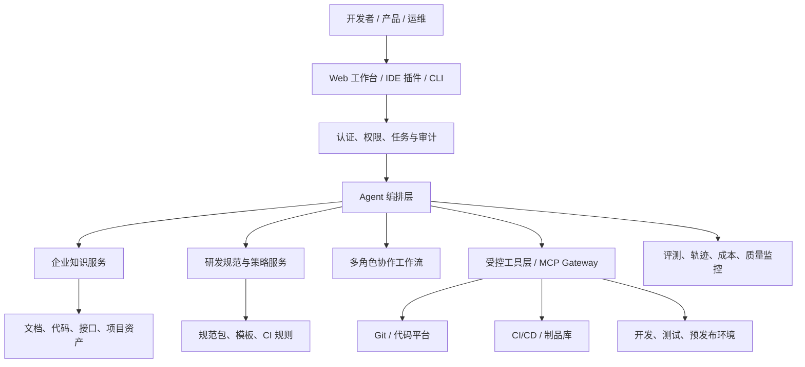

# 企业知识库开发助手产品方案

## 1. 产品定位

企业知识库开发助手是一个受企业知识、研发规范、权限体系和交付流程约束的 AI 研发协作平台。它服务于新入职开发者、研发团队、产品人员和运维人员，帮助企业沉淀可信知识、落实研发规范、提升项目交付效率。

首期仅覆盖研发与交付协作，不包含线上业务故障排查、根因分析和运维事件处置。

## 2. 产品目标

1. 将企业业务、项目、代码和研发资产转化为可授权、可引用、可持续更新的 AI 知识库。
2. 帮助新入职开发者快速理解业务、项目结构、接口链路和本地开发方式。
3. 将目录、命名、注释、测试、Git 与交付流程等研发规范转化为可执行规则。
4. 在企业规范约束下，辅助开发者完成需求澄清、方案设计、编码、测试和 PR 草稿生成。
5. 通过多角色 Agent 协作，辅助完成新项目的调研、产品方案、技术方案与部署方案。
6. 通过受控 CI/CD 流程辅助交付，确保 Agent 不绕过企业发布与审批机制。

## 3. 核心设计原则

- **可信优先**：业务事实必须有知识来源；证据不足时明确说明不确定性。
- **权限优先**：知识、代码、工具和部署权限相互独立，并按用户权限实时过滤。
- **规范可执行**：研发规范不能只停留在提示词中，必须由模板、规则引擎和 CI 共同执行。
- **人机协同**：Agent 可以提出方案、生成代码和发起流程，但高风险决策必须由人批准。
- **最小权限**：默认只读；写代码、创建 PR、触发流水线等权限按任务、项目和角色授予。
- **全过程审计**：知识访问、模型调用、工具调用、代码变更、测试和审批均可回溯。

## 4. 用户与核心场景

| 用户角色 | 核心场景 | 主要收益 |
|---|---|---|
| 新入职开发者 | 项目导览、业务学习、本地启动、任务式上手 | 缩短熟悉业务与代码的时间 |
| 后端开发者 | 查业务规则、生成实施计划、编码与测试、PR 准备 | 减少重复检索和机械性工作 |
| 前端开发者 | 查询接口契约、设计规范、页面任务拆分 | 降低跨端协作与接口理解成本 |
| 产品经理 | 业务知识查询、需求澄清、验收标准整理 | 提升需求质量与可交付性 |
| 运维工程师 | 部署方案、环境清单、发布检查、回滚预案 | 提升交付标准化程度 |
| 技术负责人 | 规范治理、质量门禁、Agent 审计与效果评估 | 提升研发治理能力 |

## 5. 产品功能架构



## 6. 功能模块

### 6.1 企业知识库与新人上手

**知识来源**：业务文档、Wiki、代码仓库、README、架构文档、接口定义、数据库字典、发布记录、测试资产和项目管理文档。

**核心能力**：

- 混合检索：关键词、向量、元数据过滤与重排序。
- 权限过滤：只检索用户被授权访问的业务域、项目和文档。
- 引用式回答：回答附带文档、章节、代码文件、接口或原始链接。
- 项目导览：解释系统边界、目录结构、核心模块、上下游依赖与调用链。
- 新人路径：生成 7/14/30 天学习计划，包含阅读、实操与验证任务。
- 知识治理：保留来源、版本、责任人、更新时间、有效期和密级。

### 6.2 研发规范中心

规范包按企业公共规范、技术栈规范和项目规范分层管理。

```text
standards/
  common/
    security.yaml
    git-workflow.yaml
    review-checklist.md
  go-service/
    project-template/
    naming.yaml
    lint.yaml
    test-policy.yaml
  react-web/
    project-template/
    component-policy.yaml
    test-policy.yaml
```

规范覆盖：

- 项目目录与分层边界。
- 命名、接口、错误码与日志规范。
- 注释和文档更新规则。
- 单元、集成、契约与端到端测试标准。
- 分支、提交信息、PR 和 Code Review 流程。
- 密钥、依赖漏洞、权限校验和敏感数据安全规则。
- 发布、灰度、回滚与变更管理要求。

每条规范均区分为四类：指导性规则、模板性规则、检查性规则和阻断性规则。阻断性规则必须由 CI 或策略引擎执行。

### 6.3 企业规范下的 AI 编码助手

AI 编码不是“输入一句话直接改生产代码”，而是受控交付闭环：

```text
需求澄清 → 知识检索与规范加载 → 实施计划 → 人工确认
→ 隔离分支编码 → 格式化/静态检查/测试/扫描
→ 生成验证报告与 PR 草稿 → 人工评审
```

每项开发任务必须沉淀：

- 需求澄清单：目标、非目标、约束、验收标准和待确认问题。
- 设计说明：影响模块、接口、数据、配置、风险和回滚策略。
- 文件级实施计划。
- 代码差异和修改理由。
- 测试、扫描和规范检查报告。
- PR 描述、风险项和人工确认项。

权限级别：

| 级别 | Agent 权限 |
|---|---|
| L0 | 知识问答、方案建议 |
| L1 | 读取授权仓库、生成实施计划 |
| L2 | 在临时工作区修改代码、执行受限测试 |
| L3 | 创建分支和 PR 草稿，不可自行合并 |
| L4 | 通过审批后的 CI/CD 发起发布，不可直接获取生产 Shell 权限 |

### 6.4 多角色 Agent 协作

| 角色 | 主要输出 | 决策边界 |
|---|---|---|
| 产品调研师兼竞品分析师 | 调研报告、竞品分析、证据来源 | 不决定技术或发布方案 |
| 产品经理 | PRD、用户故事、验收标准、优先级 | 不自行承诺技术工期 |
| 后端开发 | 架构方案、API、数据设计、实现与测试计划 | 不可跳过质量和安全门禁 |
| 前端开发 | 页面方案、交互说明、前端任务和测试计划 | 不可擅自修改后端契约 |
| 运维工程师 | 环境、部署、监控、容量与回滚方案 | 不可绕过发布审批 |
| 项目协调 Agent | 冲突清单、决策记录、项目方案汇总 | 不拥有最终商业或生产决策权 |

协作采用“并行研究—工件收敛—人工决策”的方式。Agent 输出必须使用固定模板，并保留知识依据和版本记录。

### 6.5 部署与交付助手

部署助手只通过企业既有 CI/CD 平台辅助交付，不能直接登录生产服务器。

主要能力：

- 生成 Dockerfile、部署清单、环境变量模板、健康检查和资源建议。
- 校验镜像、配置、密钥引用、数据库迁移、监控、告警和回滚方案。
- 查询并受控触发 CI/CD 流水线。
- 生成发布申请、变更说明、发布前检查与发布结果报告。
- 发布后执行健康检查、冒烟测试和监控状态确认。

## 7. 关键数据与技术要求

### 7.1 知识数据要求

每个知识片段至少保存来源、版本、原始链接、业务域、项目、责任人、更新时间、访问控制标签与有效期。回答中引用的内容必须可定位至原始资产。

### 7.2 安全要求

- 接入企业 SSO，统一身份认证。
- 知识、仓库、工具、CI/CD 分别授权。
- 敏感数据脱敏，密钥不可进入提示词、日志和向量库。
- 工具经网关执行，支持白名单、参数校验、限流和审批。
- 代码执行使用隔离工作区，限制网络、资源、执行时长和可访问目录。
- 所有高风险操作具备审批、审计和撤销能力。

### 7.3 可观测与评测要求

应记录检索命中、引用覆盖率、模型成本、响应时间、工具成功率、任务完成率、测试通过率、人工拒绝率和安全事件。模型、提示词、工具或规范规则变更前，必须通过回归评测。

## 8. MVP 产品边界

首期建议只选择一个业务域、一种主技术栈和 1～3 个仓库，完成以下闭环：

1. 授权用户可以针对业务文档和代码进行带引用问答。
2. 新人可以获得项目导览与上手路径。
3. 一个技术栈的目录、命名、测试和 PR 规范可以自动检查。
4. 开发者可以在隔离分支中完成“澄清—计划—编码—测试—PR 草稿”。
5. Agent 的所有访问、修改、工具调用和审批均可审计。
6. 不授予 Agent 主分支合并、生产 Shell 或绕过审批的权限。

## 9. 产品成功指标

| 指标类别 | 建议指标 |
|---|---|
| 知识质量 | 引用覆盖率、回答正确率、过期知识命中率、用户纠错率 |
| 新人效率 | 完成上手任务的时间、人工答疑次数、学习任务完成率 |
| 研发质量 | 规范违规检出率、误报率、测试通过率、PR 合并率 |
| 开发效率 | 实施计划生成时间、重复性工作减少量、人工修改比例 |
| 安全治理 | 越权访问次数、审批拒绝率、敏感信息泄露事件 |
| 平台运营 | 任务成功率、响应时间、模型成本、工具失败率 |

## 10. 产品非目标

- 不替代产品负责人、技术负责人或发布审批人做最终决策。
- 不在首期建设线上故障排查、告警根因分析与自动修复。
- 不让 Agent 无审批地修改主分支、合并代码或发布生产。
- 不以单一大模型或单一向量数据库替代知识治理、权限和研发流程。
